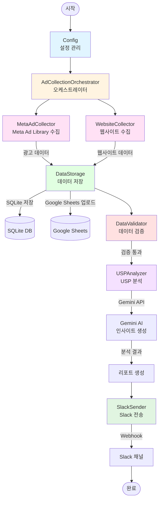
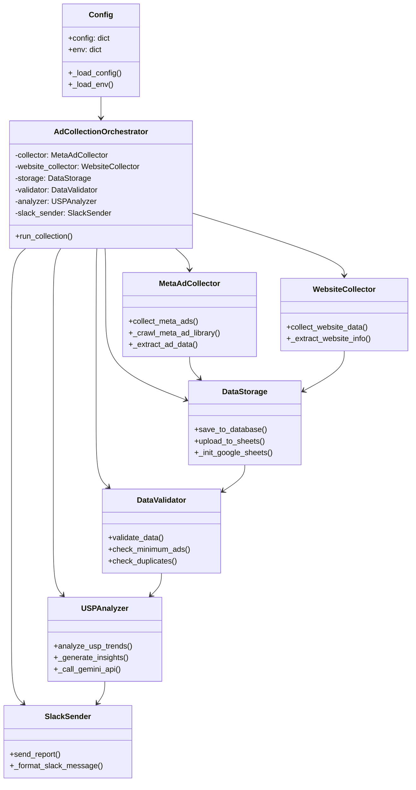
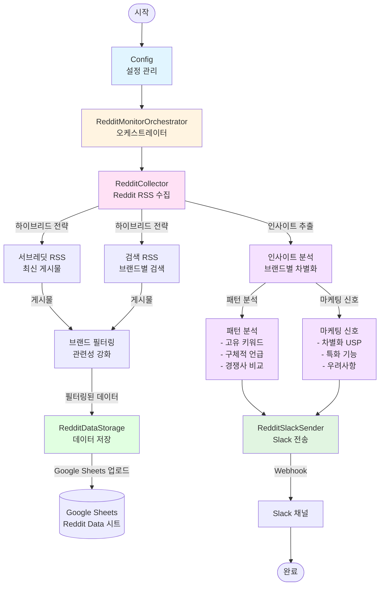
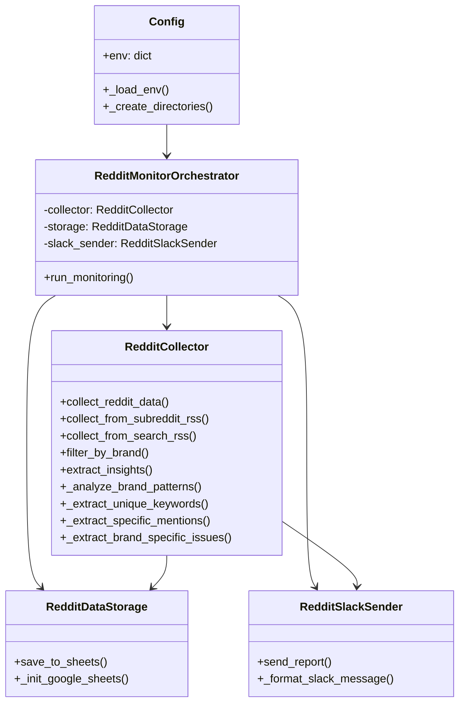
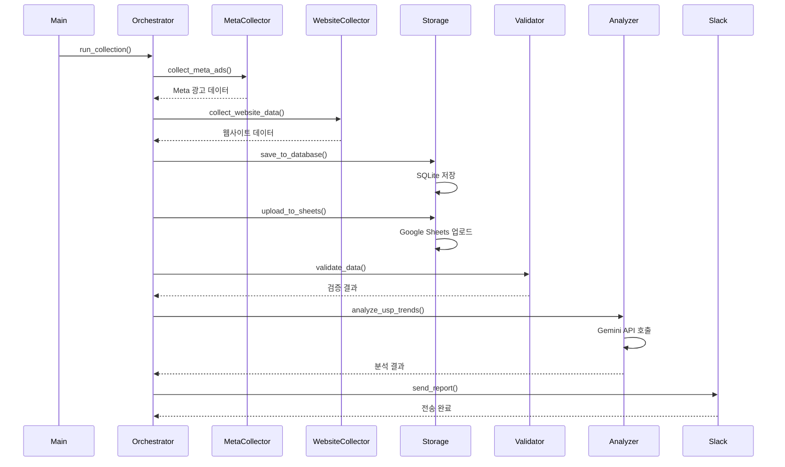
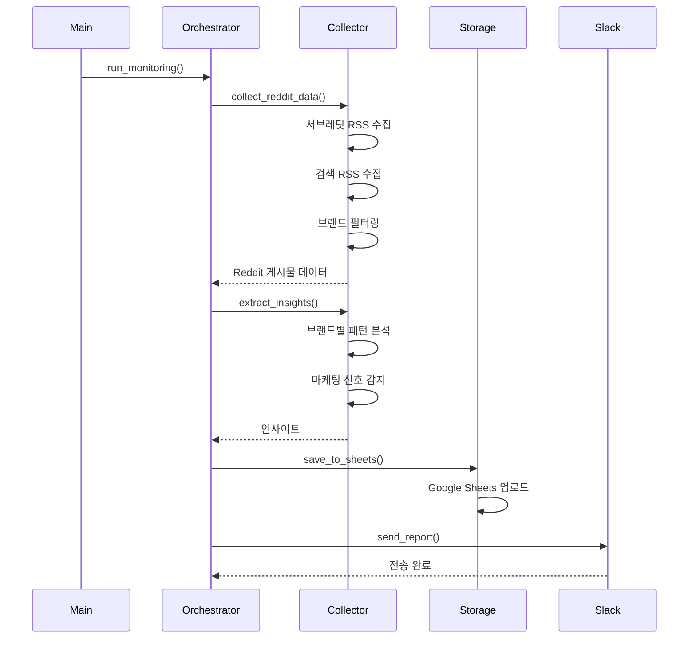
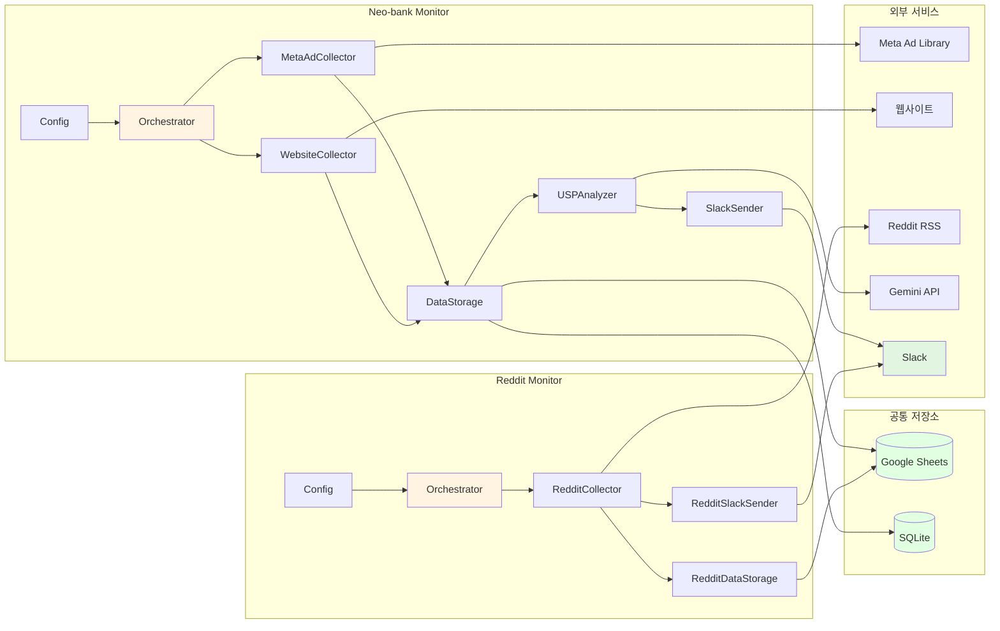

# Neo-bank 모니터링 시스템 아키텍처

## 1. Neo-bank Monitor (Meta Ads + Website)

### 주요 클래스 구조

## 2. Reddit Monitor (Reddit RSS)

### 주요 클래스 구조

## 3. 데이터 흐름

### Neo-bank Monitor 데이터 흐름

### Reddit Monitor 데이터 흐름

## 4. 시스템 통합 구조

